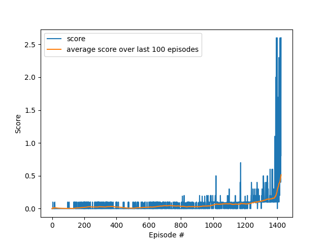
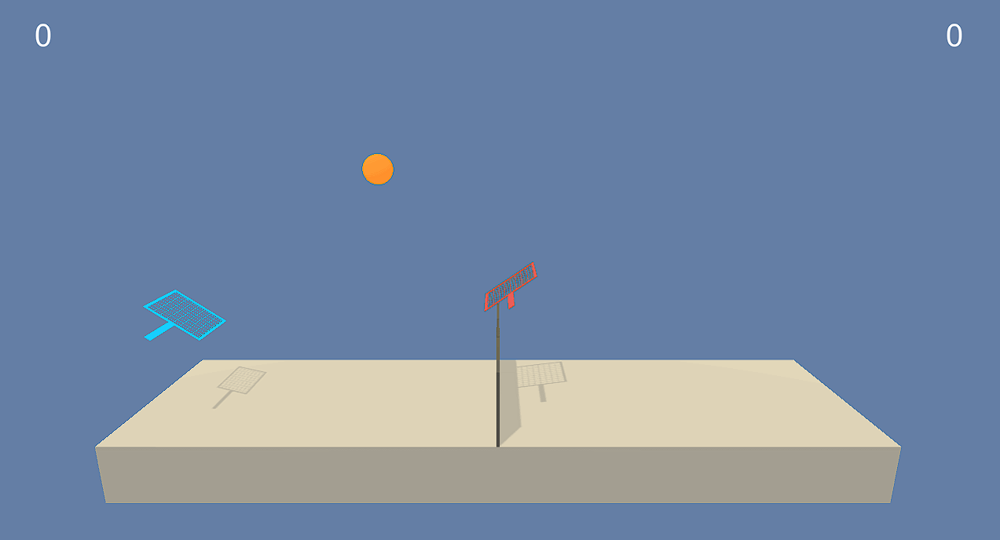

### Algorithm:
The algorithm used for solving the unity environment is the Multi Agent Deep Deterministic Policy Gradient algorithm. In this algorithm, every agent has four neural networks are used. 
The policy network gets an observation as an input and outputs an action. Note that each agent might not be able to observe the whole state and therefore has its own observations.
The Q-Value network gets the full state (every observation of each agent) and the action of each agent as an input and outputs the corresponding Q-Value. Both networks have local versions for computing the corersponding values
 in the algorithm and target versions that are used for computing the next action and the next state during the process of learning. 
Just the local networks are trained and the target networks are updated by computing a convex combination of themselves and the corresponding local network. 
This process is called soft update. The algorithm interacts with the environment, saves the data received from the environment a shared replay buffer and learns. In the learning process, samples are randomly chosen from the replay buffer
 and with these samples, the local networks are trained. The loss for the Q-value network is the TD-error and for the policy network the mean of the negative Q-values 
computed when the input is the given state and the actions computed by eachpolicy network. Afterwards, the target  networks are updated and the process starts again.

### Network architecture:
The local policy network of each agent has an input layer with 24 neurons (one for each dimension of the state space), 
two linear hidden layers with 512 and 256 neurons and an output layer with 2 neurons (one for each dimension of the state space). 
After both hidden layers, the relu activation function is used. After the output layer the tanh activation function is used. 
The input of this network is a state.
The local Q-value network has an input layer with 52 neurons ((number dimensions state space + number dimensions action space)* number agent), 
two linear hidden layers with 512 and 256 neurons and an output layer with 1 neuron. After both hidden layers, 
the relu activation function is used. The input of the Q-value network is the concatenation of all observations and all actions of each agent. 
The target networks have the same architecture as the local networks.

### Hyperparameters:
The following list shows the hyperparameters chosen for learning in the best version. For more details see file "hyperparameters.py".
- LOAD = False            
- FILENAME_FOR_LOADING="tennis_0"
- SAVE = True            
- FILENAME_FOR_SAVING="tennis_0"
- PLOT=True
- PLOTNAME="tennis_0.png"
- TRAINMODE = True
- VAL_ENV_SOLVED = 0.5

- MAX_NR_EPISODES= 10000          
- BUFFER_SIZE = int(1e6)          
- BATCH_SIZE = 512                
- GAMMA = 0.99                    
- TAU = 0.05                      
- LR_ACTOR = 0.0005                 
- LR_CRITIC = 0.0005                
- WEIGHT_DECAY = 0.0              
- UPDATE_EVERY = 2                
- SEED=0
- DEVICE = torch.device("cuda:0" if torch.cuda.is_available() else "cpu")

### Results:
The following figure displays the score of the agent during the learning process over 1423 episodes.
 The average score per episode in the episodes 1323-1423 is 0.51 and therefore the environment is considered solved after 525 episodes. 

The following gif file displays a version that was trained even further:

 

### Future Improvements:
- using a prioritized experience replay buffer
- using bootstrapping
- convolutional layers might the improve agent
    
    

